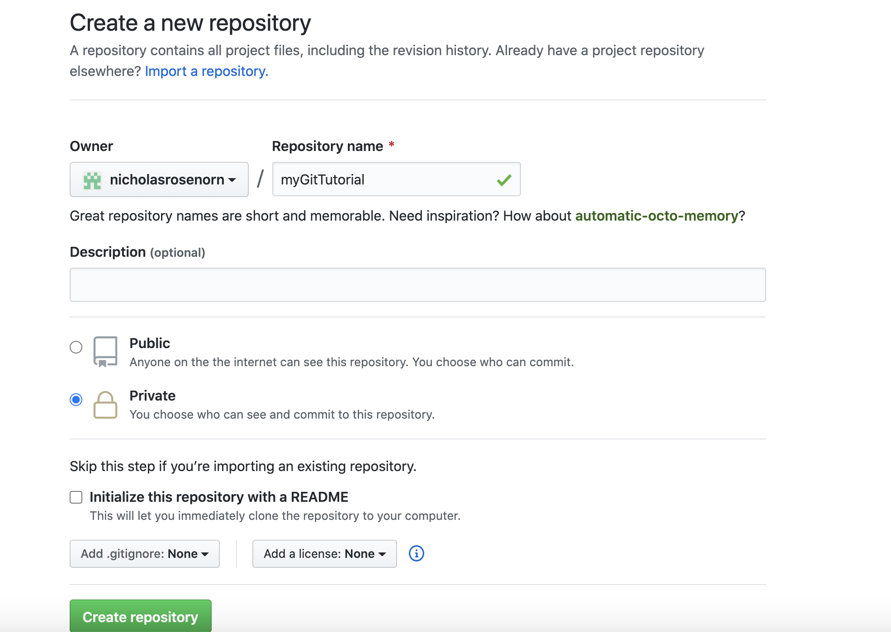
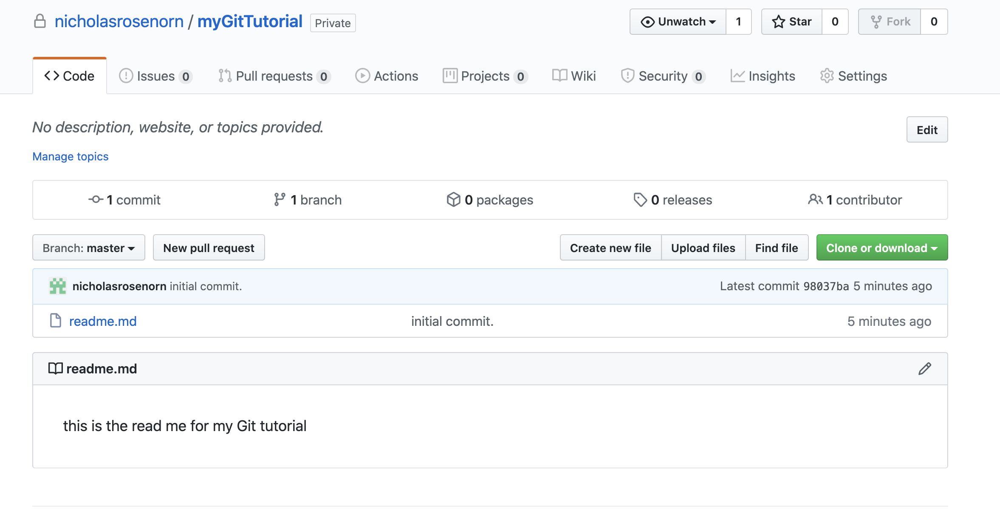
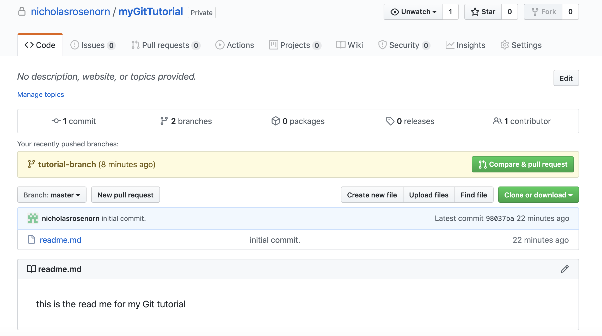
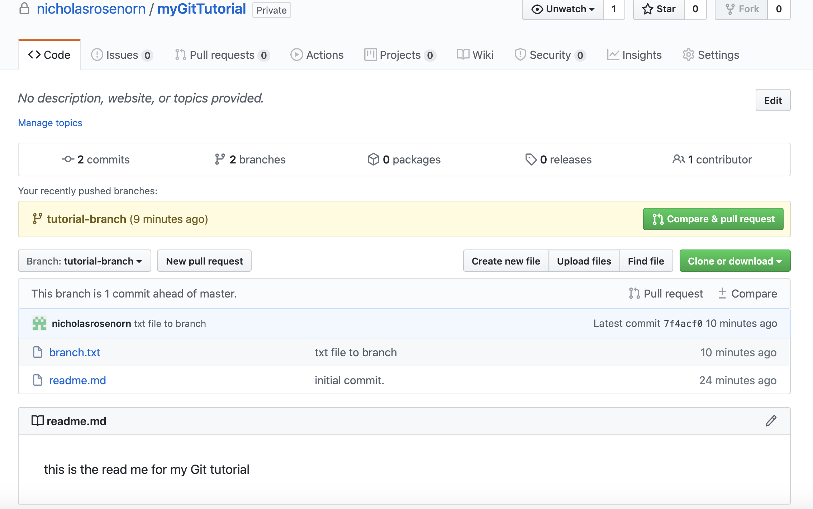
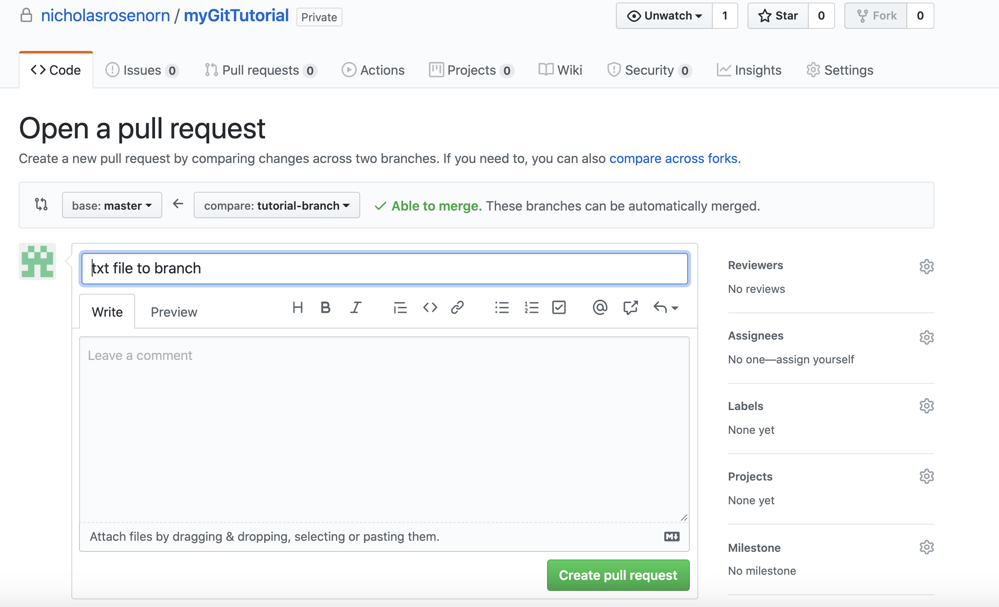
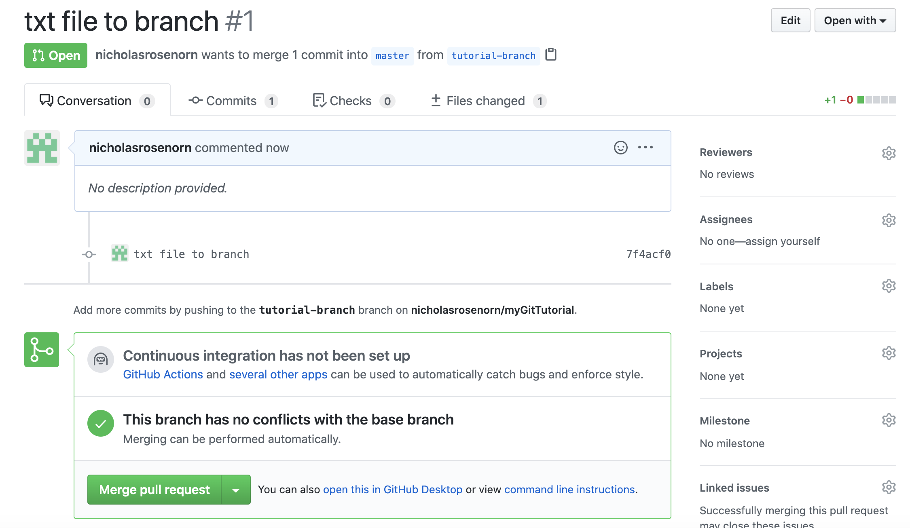
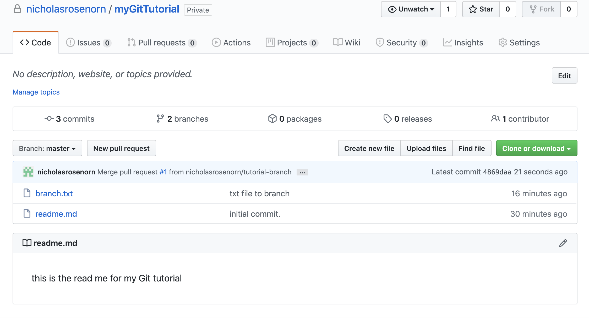

# Using Git and GitHub

## Git and GitHub Overview

Git is a distributed version-control system for tracking changes in source code during software development. It is designed for coordinating work among programmers, but it can be used to track changes in any set of files. Its goals include speed, data integrity, and support for distributed, non-linear workflows.

GitHub serves as a web-based interface for Git while also providing many otehr valuable features for version control and collaboration.

Downloading Git can be done at https://git-scm.com/downloads. GitHub is free to create to create an account at https://github.com/.

During this section, we will work through the basics of Git and GitHub!

## Important Git Commands

```{bash, eval=FALSE}
git clone                       # clone a repository into a new directory
```

```{bash, eval=FALSE}
git init                        # initialize local directory as a git repository
```

```{bash, eval=FALSE}
git add . 	                    # add files to local repository
```

```{bash, eval=FALSE}
git commit- m “commit message”	# commit files you staged in local repository
```

```{bash, eval=FALSE}
git remote add origin URL		    # sets remote location of Github repository with URL
```

```{bash, eval=FALSE}
git remote -v 				          # verifies remote location
```

```{bash, eval=FALSE}
git push 					              # pushes changes from local repository to remote repository 
```

```{bash, eval=FALSE}
git branch 				              # check which branch you are currently working on
```

```{bash, eval=FALSE}
git checkout branch-name		    # change branches
```

```{bash, eval=FALSE}
git checkout -b branch-name	    # create a new branch if branch-name does not exist 
```

```{bash, eval=FALSE}
git status 				              # displays state of working directory and changed states
```

```{bash, eval=FALSE}
git pull 					              # update local version of a repository from remote repository
```

## Git and GitHub Simple Walkthrough 

Let's learn some basics of Git and GitHub through an example.

To start, make a new directory and cd into it. 

```{bash, eval=FALSE}
mkdir myGitTutorial

cd myGitTutorial
```

Now, create a readme file and add a description within our new directory.

```{bash, eval=FALSE}
touch readme.md

echo this is the read me for my Git tutorial > readme.md
```

Initialize the Git repository.

```{bash, eval=FALSE}
git init
```

Add and commit files to local git repository.

```{bash, eval=FALSE}
git add .

git commit -m “initial commit.”
```


Now, if neeeded, create a GitHub account and then create a new repository. 

<center>{width=40%}</center>

Back in command line, set remote location of repository 

```{bash, eval=FALSE}
git remote add origin link/of/your/GitHub/repo
```

Now, we can push contents to the remote repository on GitHub.

```{bash, eval=FALSE}
git push -u origin master
```

The repository is now set up and can be viewed in Github! You will see the readme file we created in the repo.

<center>{width=40%}</center>

Next, we can create a new branch. 

```{bash, eval=FALSE}
git checkout -b tutorial-branch
```

Make a new file in the tutorial branch

```{bash, eval=FALSE}
touch branch.txt
echo this is for the tutorial branch > branch.txt
```

Stage and commit files to branch.

```{bash, eval=FALSE}
git add .

git commit -m "txt file to branch"
```

Push staged files to branch.

```{bash, eval=FALSE}
git push --set-upstream origin tutorial-branch
```

When we return to github we will notice that there are two branches!

<center>{width=40%}</center>

Notice that the master branch does not have the newly created branch.txt file. If we navigate to tutorial-branch, we will see the branch.txt file! 

<center>{width=40%}</center>

Let's update the master branch with the added files from the branch. To update the master branch, we will need to create a pull request.

Click the green button that says ‘compare and pull request’. 

<center>{width=40%}</center>

Then, click ‘create pull request’. Notice how there are no conflicts with the master branch! 

<center>{width=40%}</center>

Now click ‘Merge pull request’ and then ‘confirm merge’. 

<center>{width=40%}</center>

Once the merge is done processing we can return to the master branch and we will see that branch.txt is now available on the master!